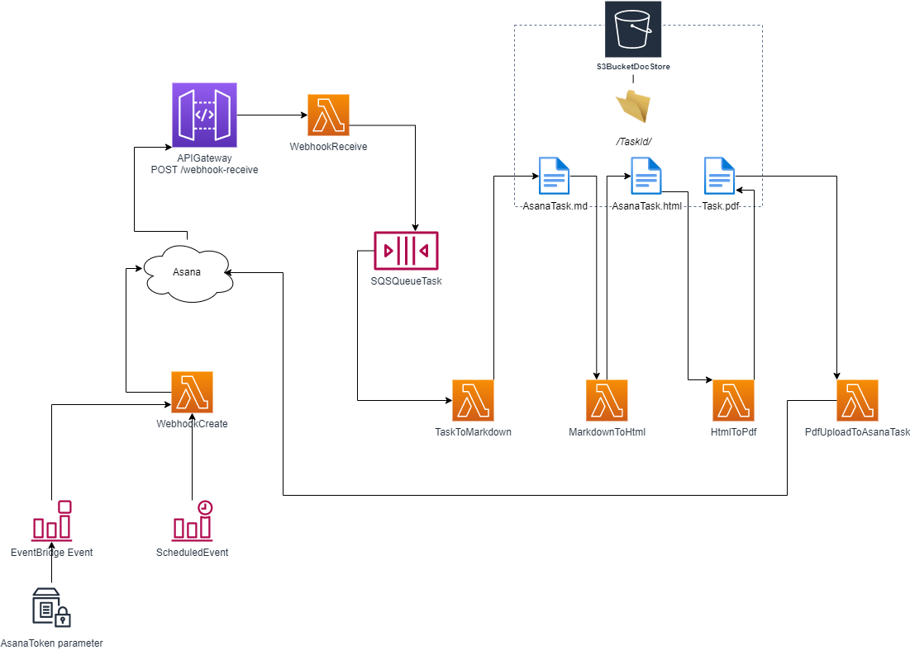

# Asana-AWS-TaskDoc

This is a serverless application, to be deployed into an AWS Account, that turns an Asana Task into a markdown document, HTML file and PDF file. The PDF file is reattached back to the Asana Task. The other files will be discarded.

## Purpose

The task details are easy to access from within Asana itself, but it is difficult to export the details into a format that can be presented to people outside the organization or people that don't use Asana. Basic reports can be generated and third-party products used, but none of them present a single task in a format that looks 'pretty'.

This application seeks to automatically turn tasks into presentable user-friendly documents that can be provided to external and non-Asana users.

The application demonstrates modern cloud architectural concepts, such as serverless, loosely-coupled architecture and infrastructure-as-code.  

**WARNING: ALTHOUGH THIS APPLICATION IS DESIGNED TO BE LOW-COST, AWS CHARGES WILL BE INCURRED, WHICH YOU (OR THE BILL-PAYER) WILL BE RESPONSIBLE FOR. USE AT YOUR OWN RISK. PLEASE SEE THE ADDITIONAL WARRENTY DISCLAIMER IN THE LICENSE FILE.**

## Features

- Repository includes both Application Code and **CloudFormation** Infrastructure-as-Code deployable as one unit.

- An **API Gateway** allows a permanent 'server' presence. This allows changes in an Asana task to be pushed to AWS using a webhook the application creates in Asana.

- **Loosely-coupled architecture** ensures each stage in the process is a separate Lambda function, written in Python. API calls, queues and intermediate files trigger each stage in the process. Failures can be retried without restarting the whole process.

- **Serverless** architecture ensures low cost, especially when few changes are made to tasks - only pay for the resources used.

- Completed PDF files are saved back to the Asana task upon generation, replacing any previous files of the same name.

- The solution is **automated.** No user intervention is required: the PDF document is constantly updated as the task is changed and available for the user to open or download from within the task itself.

## How to deploy

#### Prerequisites

- AWS Account.
- Accessible S3 bucket accessible available in the AWS Account. This will be needed to store the transformed Cloudformation template.
- AWS CLI installed and configured on your local computer.
- Asana Account.
- API Developer Token from the Asana Account.

#### Copy the repository to your local computer.

Use git clone or unzip the repo to your local computer taking care to preserve the directory structure.

#### (Optional) Customise the Markdown Template

The file '''/functions/AsanaTaskToMarkdown/templates/template.md''' provided is suitable for demonstration purposes. It contains placeholders that correspond to the field names in Asana. This may be edited or replaced as required, providing the name is retained.

#### (Optional) Customise the CSS File

The file '''/functions/HtmlToPdf/css/markdown.css''' may be used. It may also be replaced by any other css file. This is used for generating the PDF document from the HTML file.

#### Transform the Template and Package the Code.

Change the current directory to the root of the directory containing the CloudFormation template. Run the `aws cloudformation package` command against the CloudFormation template. This will zip up and copy the code to an S3 Bucket ready for deployment and will transform the relative paths in the template into absolute paths to your s3 bucket.

For example, if the CloudFormation template is 'Asana-AWS-TaskDoc.template.yaml' and the bucket is called 'mys3bucket' and the packaged template will be called 'packaged-template.yaml' the command should be:  

```
aws cloudformation package --template-file Asana-TaskDoc.template.yaml --s3-bucket mys3bucket --output-template packaged-template.yaml
```

#### Deploy the Transformed Template.

The transformed template may now be deployed within the AWS Account. The easiest way to do this is using the [CloudFormation console](https://console.aws.amazon.com/cloudformation/home). Create a new stack and specify the name of the transformed template, provide a stack name and fill out the parameters. The other settings can be left at the default.

- In **Specify template** it must be the packaged template that is specified. The original CloudFormation template is not deployable.

- In **Specify stack details** the **Stack name** must not begin with "aws" or "ssm" (case-insensitive). All of the parameters must be present.

- In **Configure stack options** all of the defaults may be accepted.

- In **Review** remember to check all three **Capabilities and transforms** boxes.

#### Add the Asana API Token to the Parameter Store.

To initially create the webhook, the Asana API Token will need to added to the Systems Manager Parameter Store at [](https://console.aws.amazon.com/systems-manager/parameters/). When this parameter is created or updated, the webhook will be created and the application will start processing Asana events. This token will be used for all authentication with Asana.

- The parameter name should follow the CloudFormation stack name. For example, if the Stack Name is 'Asana-AWS-TaskDoc-A' then the parameter will be ```/Asana-AWS-TaskDoc-A/AsanaToken```

- The *Type* should be *SecureString*

- All of the other details may be left at the default.

#### Test the Stack

Login to the Asana application and navigate to the Project Id specified within the Workspace Id specified. Make a change to a Task. Within about one minute a PDF document should appear attached to the Task. This file will be named asana_task_*TaskId*

## System Design

#### Basic Architecture



#### Process for Setting-up Webhooks

1. An EventBridge scheduled event is triggered at an interval determined by the CloudFormation Parameter. It triggers the **WebhookCreate** Lambda function. There is an additional EventBridge event that is triggered whenever the AsanaToken parameter is created or updated.

2. The **WebhookCreate** function looks up the Id of any previously created webhook from the parameter store. It generates an unique URL token, which it stores in the Parameter Store. It changes the Setup parameter to 'True'. It obtains the API Gateway URL and Asana API token from the Parameter Store. It makes a request to the Asana API to create a webhook, using the API Gateway URL with the URL token as a query string and the Asana Token for authentication. It deletes any previously created webhooks.

3. Asana uses the URL provided to make an API call using the POST method to the webhook-receive resource on the API Gateway. The payload includes an X-Hook-Secret as a header.

4. The API call is proxied to the **WebhookReceive** function. The function checks the correct URL query string is provided by comparing its value to the URL string stored in the Parameter Store. The function recognises an attempt to setup a webhook through the use of the X-Hook-Secret header. The function ensures that the setup flag is set to 'True'. Providing all the checks complete successfully, the function returns the X-Hook-Secret back to Asana and the webhook is setup.

#### Process for Handling Events

1. The user changes a field value in a task in Asana, which is associated with the appropriate Project and Workspace Id.

2. An event is generated and sent to the API Gateway. Asana uses the URL provided to make an API call using the POST method to the **webhook-receive** resource on the API Gateway.

3.
   - The event is forwarded to the **WebhookReceive** function. Providing the security checks are passed, the TaskId is extracted by the function  and sent to the **SQSQueueTask**.
   - The function **TaskToMarkdown** is invoked by the message placed in the queue. The function uses the Task Id to make API request(s) back   to the Asana API to obtain comprehensive task details
   - The results of the request(s) are manipulated to create a flat dictionary containing most of the Asana fields in string format.
   - The dictionary is parsed and the field names compared to the placeholders in the **template.md** file. Where a field value is present, the placeholder text is replaced by the field value.
   - The final markdown file is written to the **S3BucketDocStore**

4.  The **MarkdownToHtml** function downloads the markdown file from the S3 Bucket and uses the wkhtmltox package to convert it to HTML. The HTML file is uploaded back to the S3 Bucket.

5. The **HtmlToPdf** function downloads the html file and uses the mistletoe package to convert it to a pdf document. This is uploaded back to the S3 Bucket.

6. The **PdfUploadToAsanaTask** function downloads the pdf file and uploads it back to the Asana Task as an attachment.


### Customisations

- markdown.css and template.md may be replaced and edited, providing the file name and path is preserved.
- The markdown.css file may be replaced and edited, providing the file name and path is preserved.


### Limitations and Ideas for Improvement

- The application is designed to ensure that only legitimate webhooks from Asana are setup and only legitimate events are processed The security permissions within the application are fairly broad. For example, all functions have get and push permissions for all parameters used by the application. This could be made more secure by specifying different permissions for individual functions and parameters. This would add considerably to the complexity of the CloudFormation template. The same principle applies to permissions on the S3 Bucket.

- Only a single project id can be specified. If multiple projects need to be used, a CloudFormation stack will be required for each project.

- Only a single template and single css file can be used. Multiple versions are required for different files.

- Dependencies and Dependants in Asana are not currently supported. This is because most of the dependency details are not returned when making an API call for a particular task. Additional requests to the API would be required to obtain details from the API.
